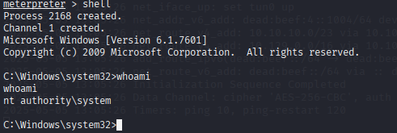

# Blue (using metasploit)

<figure><figcaption></figcaption></figure>

firstly let\`s find open ports using nmap :

<figure><figcaption></figcaption></figure>

so there is smb lets check its version using metasploit&#x20;

> using this commnad to open metasploit&#x20;

```
msfconsole
```

then lets search about smb version

> 

use 103

<figure><figcaption></figcaption></figure>

then lets enter options to see what does options we have&#x20;

we can see must enter the rhosts which its the target ip&#x20;

<figure><figcaption></figcaption></figure>

as detatils we see windows 7 professional SP1  and SMB 1,2  as its details its eternalblue cve&#x20;

here is the some links of wanna some details of CVE-2017-0144





now lets search enternalblue in metasploit

<figure><figcaption></figcaption></figure>

use 0

then enter the ip address of target in RHOSTS and in LPORT is tun0

<figure><figcaption></figcaption></figure>

then run&#x20;

<figure><figcaption></figcaption></figure>

here is we exploit it the machine&#x20;

and enter 'shell' to enter cmd shell enviroment&#x20;

<figure><figcaption></figcaption></figure>

you will find the the user.txt in c:\Users\haris\Desktop\user.txt and root flag in c:\Users\Administrator\Desktop\root.txt

<figure><figcaption></figcaption></figure>

<figure><figcaption></figcaption></figure>
